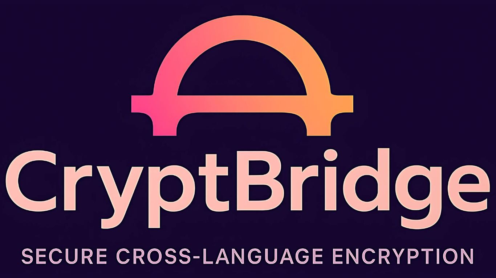

<div align="center">
  
</div>

# CryptBridge

**The AES-256-CBC bridge for Laravel ⇄ Bun**

CryptBridge lets your polyglot stack services in Bun read and write encrypted blobs compatible with Laravel's Crypt::encryptString(), so every runtime shares data securely with zero changes to your PHP code.

## Problem Statement

Modern stacks often pair a **Laravel** application (PHP) with high-performance micro-services or edge functions written in **Bun / TypeScript**.  

Out of the box, Laravel stores sensitive values (DB columns, cookies, queued payloads) with its own `Crypt::encryptString()` format:

* AES-256-CBC encryption (OpenSSL)  
* 16-byte random IV, base64-encoded  
* HMAC-SHA-256 over **`base64(iv)+base64(ciphertext)`**  
* JSON wrapper → base64

A Bun service that must **read** or **produce** the same blobs has two bad options today:

1. **Disable encryption** or duplicate data → security / consistency risk.  
2. Re-implement the spec ad hoc, with subtle chances to get the MAC or padding wrong.

> **Goal:** drop-in helpers that make encryption / decryption *identical* to Laravel, with no full Laravel install and no crypto guess-work.

## Features

|                            | ✔️ |
|----------------------------|---|
| Encrypt UTF-8 strings in Bun so **Laravel can decrypt** | ✔️ |
| Decrypt blobs produced by **Laravel's `Crypt` facade`** | ✔️ |
| Same payload layout: AES-256-CBC + HMAC + JSON + base64 | ✔️ |
| Timing-safe MAC verification                           | ✔️ |
| Zero Laravel install required for consumers            | ✔️ |
| Lightweight cross-tests (dev-dependency only: `illuminate/encryption`) | ✔️ |

## Installation

```bash
bun add cryptbridge                   # library
bun add -d js-base64 @types/node     # peer deps
```

## Quick Usage

```ts
import { encryptLaravel, decryptLaravel } from "cryptbridge";
import * as crypto from "crypto";

// 32-byte key — same value as your Laravel APP_KEY (strip "base64:")
const key = Buffer.from(process.env.APP_KEY!.replace("base64:", ""), "base64");

// Bun ➜ Laravel
const blob = encryptLaravel(key, "Hello from Bun!");
// store blob in DB or send via HTTP

// Laravel ➜ Bun
const plain = decryptLaravel(key, blob);
console.log(plain); // → Hello from Bun!
```

## API

### `encryptLaravel(key: Buffer, plaintext: string): string`

* `key` – 32-byte buffer (AES-256).  
* Returns **base64 payload** identical to `Crypt::encryptString()`.

### `decryptLaravel(key: Buffer, blob: string): string | null`

* Verifies MAC (timing-safe).  
* Returns plaintext or `null` if tampered / wrong key.

## Security

CryptBridge implements the same security guarantees as Laravel's encryption:

* **CBC + HMAC**: AES-256-CBC with HMAC-SHA256 for authenticated encryption
* **32-byte key**: Same key format as Laravel's APP_KEY (after removing "base64:" prefix)
* **IV generated internally**: Fresh 16-byte random IV for each encryption
* **Timing-safe MAC check**: Constant-time comparison to prevent timing attacks

This provides both confidentiality and integrity for your encrypted data.

## PHP Interoperability Testing

CryptBridge includes a comprehensive test suite to verify compatibility with Laravel's encryption.

### Setup PHP Tests

```bash
# One-time setup
cd php-interop && composer install && cd ..
```

### Testing Methods

The library provides two complementary testing approaches:

1. **JSON Vector Testing**: Pre-generated test vectors with various input types
   ```bash
   # Generate test vectors
   php php-interop/test-vectors.php
   ```

2. **Direct PHP Process Testing**: Real-time cross-language verification 
   ```bash
   # Uses encrypt.php and decrypt.php to spawn PHP processes
   # This is automatically included in 'bun test'
   ```

Run the complete test suite with:
```bash
bun test
```

All tests use only the stand-alone `illuminate/encryption` component (≈ 0.4 MB), so no full Laravel framework is needed.

## CI Integration

CryptBridge includes GitHub Actions workflow configuration in `.github/workflows/test.yml` for automatic testing of cross-language compatibility on each commit.

## Road-map

* Optional GCM mode (simpler payload, built-in tag)  
* Browser-side decrypt variant (WebCrypto) for JS clients  
* CLI utility for one-off encrypt / decrypt

## Contributing

1. Fork → feature branch → PR
2. Run `bun test` to verify your changes
3. For PHP interoperability changes, verify with `cd php-interop && composer install && cd .. && bun test`

## License

MIT — see `LICENSE`.
